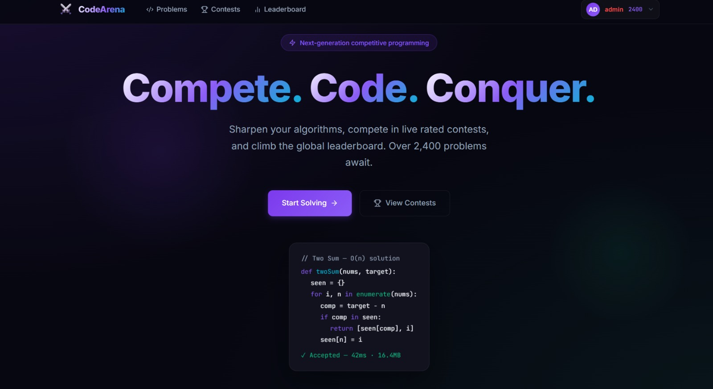
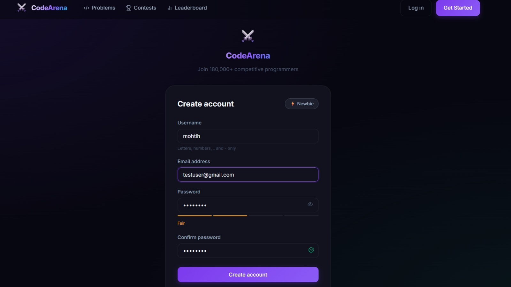
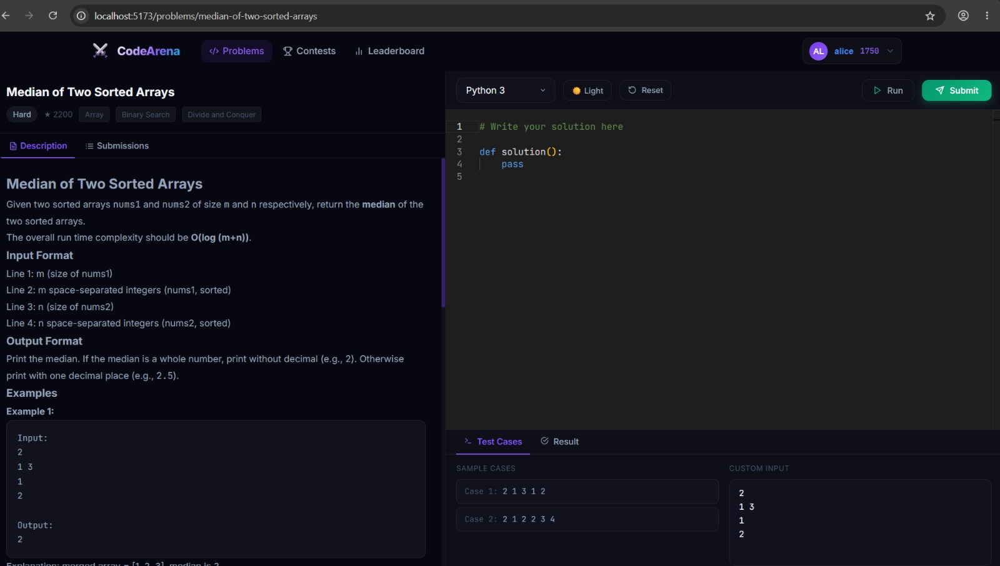
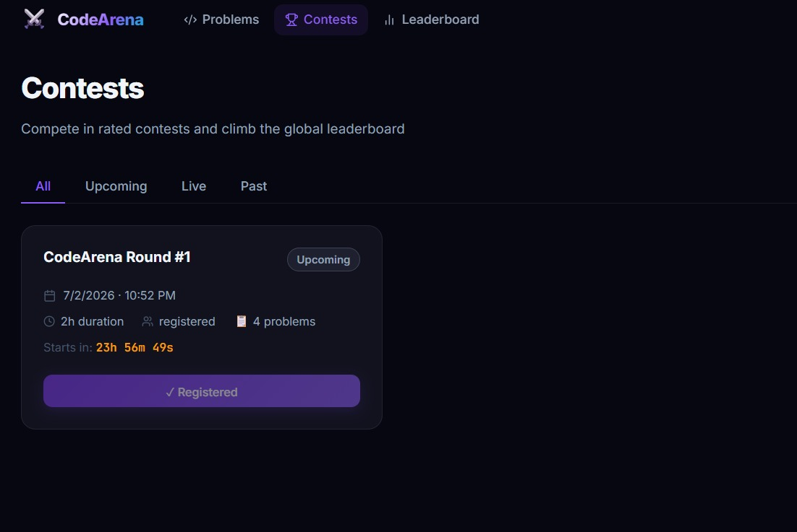

# CodeArena — Distributed Online Judge Platform

A distributed competitive programming platform that combines LeetCode's coding experience with Codeforces-style contests, ratings, and secure code execution.


---

## Features

| Feature | Description |
|---------|-------------|
| JWT Authentication | Register, login, refresh tokens |
| Problem Bank | 15 seeded problems (Easy–Expert, 800–2200 rating) |
| Monaco Editor | VS Code-powered code editor |
| Multi-language Support | Python, JavaScript, Java, C++, C |
| Docker Sandbox | Secure isolated execution |
| Real-time Results | Socket.IO + Redis Pub/Sub |
| Elo Rating System | Codeforces-inspired rating algorithm |
| Contests | ICPC-style contests with live standings |
| User Profiles | Rating history, submissions, statistics |

---

## Architecture

```
Frontend (React/Vite)
        │
 REST + WebSocket
        │
        ▼
API Server (Express)
        │
 ├── PostgreSQL
 ├── Redis
 └── Socket.IO
        │
     BullMQ
        │
        ▼
Worker Service
        │
 Docker Sandbox
        ├── Python
        ├── Node.js
        ├── Java
        ├── C++
        └── C
```

---

## Quick Start

### Prerequisites

- Docker Desktop
- Node.js 20+
- Git

### Clone

```bash
git clone <repo-url>
cd codearena
cp .env.example .env
```

Edit `.env` and configure your secrets.

### Pull Sandbox Images

```bash
docker pull python:3.12-slim
docker pull node:20-slim
docker pull openjdk:21-slim
docker pull gcc:14-slim
```

### Start Services

```bash
docker-compose up --build
```

### Database

```bash
docker exec codearena_api npx prisma migrate dev --name init

docker exec codearena_api npm run db:seed
```

Open:

```
http://localhost:5173
```

---

## Project Structure

```
distributed-code-judge/
│
├── api-server/
├── worker-service/
├── frontend/
├── sandbox-images/
├── docker-compose.yml
├── .env.example
└── README.md
```

---

## Security

Each submission executes inside an isolated Docker container with:

- Network disabled
- PID limits
- Memory limits
- CPU limits
- No privilege escalation
- Seccomp profile

---

## Verdicts

| Verdict | Description |
|---------|-------------|
| ACCEPTED | All test cases passed |
| WRONG_ANSWER | Output mismatch |
| TIME_LIMIT_EXCEEDED | Execution exceeded time limit |
| MEMORY_LIMIT_EXCEEDED | Memory limit exceeded |
| RUNTIME_ERROR | Program crashed |
| COMPILATION_ERROR | Compilation failed |

---

## Rating System

| Rating | Rank |
|---------|------|
| <1200 | Newbie |
| 1200–1399 | Pupil |
| 1400–1599 | Specialist |
| 1600–1899 | Expert |
| 1900–2099 | Candidate Master |
| 2100–2299 | Master |
| ≥2300 | Grandmaster |

---

## API

| Method | Endpoint |
|---------|----------|
| POST | `/api/auth/register` |
| POST | `/api/auth/login` |
| POST | `/api/auth/refresh` |
| GET | `/api/problems` |
| GET | `/api/problems/:slug` |
| POST | `/api/submissions` |
| GET | `/api/submissions/:id` |
| GET | `/api/contests` |
| POST | `/api/contests/:id/register` |
| GET | `/api/contests/:id/standings` |
| GET | `/api/leaderboard` |

---

## Development

```bash
docker-compose logs -f api-server

docker-compose logs -f worker

docker-compose restart api-server

docker-compose down

docker-compose down -v
```

---

## Tech Stack

- React
- Vite
- Express.js
- PostgreSQL
- Prisma ORM
- Redis
- BullMQ
- Socket.IO
- Docker

---

## 📸 Screenshots

### Landing Page



---

### Registration



---

### Problem Solving



---

### Contest Page



---

## License

MIT License